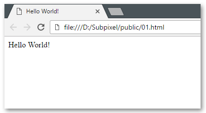

# Hello World!

Let's begin with something easy.
1. Create new folder called `public` in the project's root directory.
2. Create new HTML file called `01.html` in folder `public`
3. Write minimal HTML document that will pass the test (run `npm test`)

When "Hello World!" text is placed in both `title` and `body` tags, it should look something like this when opened in the browser:

If you don't know where to start, I recommend [Interneting Is Hard](https://internetingishard.com/) tutorial.